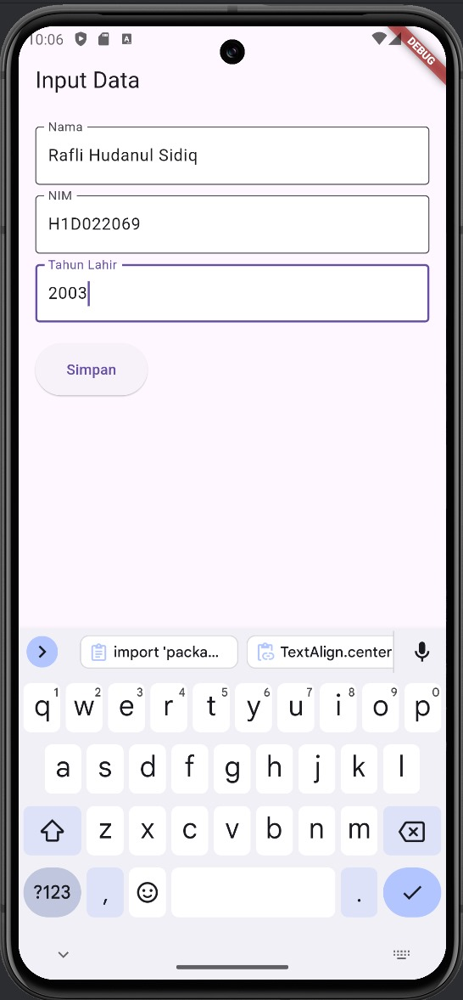
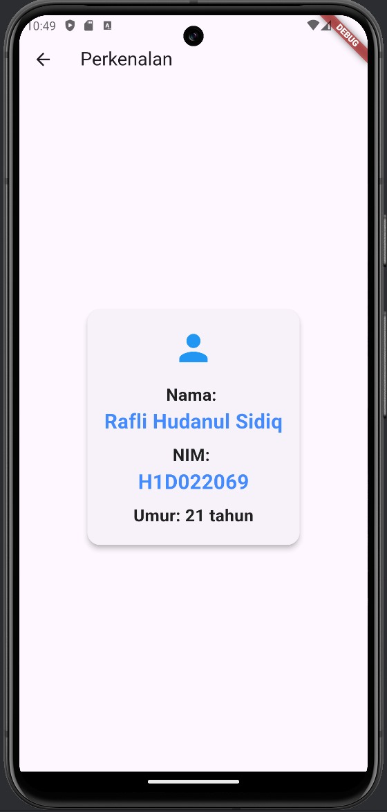

# Tugas Pertemuan 2


Nama : Rafli Hudanul Sidiq 

NIM : H1D022069

Shift Baru: F

1. **Input data di Form**
    - Terdapat widget FormData yang berfungsi sebagai antarmuka untuk mengumpulkan informasi dari pengguna.
    - Di dalam FormDataState, menggunakan tiga TextEditingController (_namaController, _nimController, _tahunController) untuk mengambil input pengguna.

2. **Pengolahan data**
    - Setelah pengguna mengisi form dan menekan tombol "Simpan" (_tombolSimpan), data dari kontroler diambil:
   ```dart
      String nama = _namaController.text;
      String nim = _nimController.text;
      int tahun = int.parse(_tahunController.text);
   ```
   - Data yang diambil adalah nama, NIM, dan tahun lahir, di mana tahun lahir diubah menjadi tipe data int.
    

3. **navigasi dan passing data**
    - menggunakan Navigator.of(context).push untuk melakukan navigasi ke halaman baru (TampilData) dan mengirimkan data yang telah diinputkan:
   ```dart
      Navigator.of(context).push(MaterialPageRoute(
      builder: (context) => TampilData(nama: nama, nim: nim, tahun: tahun)
      ));
   ```
    - Di sini, Membuat instance dari TampilData dan mengirimkan nama, nim, dan tahun sebagai argumen ke constructor TampilData.


4. **Menerima Data di Halaman TampilData**
    - Di kelas TampilData, Anda menerima data tersebut melalui parameter konstruktor:
   ```dart
      const TampilData({
      Key? key,
      required this.nama,
      required this.nim,
      required this.tahun,
      }) : super(key: key);
   ```
    - Variabel nama, nim, dan tahun sekarang tersedia di dalam TampilData untuk digunakan.

5. **menampilkan data**
    - Dalam metode build dari TampilData, Anda menghitung umur berdasarkan tahun yang diterima:
      ```dart
      final int umur = DateTime.now().year - tahun;
      ```
    - Terakhir, Anda menampilkan data menggunakan widget Text, yang sudah dirapikan, di dalam Container.

## Screenshot
Contoh :


